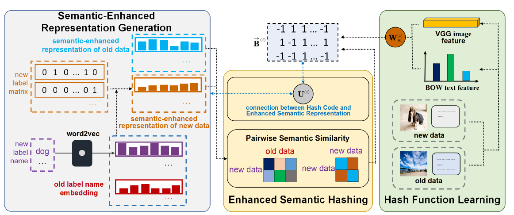

# Online Enhanced Semantic Hashing Towards Effective and Efficient Retrieval for Streaming Multi-Modal Data

Official implement of OASIS.  | [Paper](https://arxiv.org/abs/2109.04260) | [Personal Homepage](https://dravenalg.github.io/).

Xiao-Ming Wu, Xin Luo, Yu-Wei Zhan, Chen-Lu Ding, Zhen-Duo Chen, Xin-Shun Xu.

Accepted at AAAI 2022!

If you have any questions, feel free to contact me by wuxiaoming.alg@gmail.com.

## abstract

With the vigorous development of multimedia equipment and applications, efficient retrieval of large-scale multi-modal data has become a trendy research topic. Thereinto, hashing has become a prevalent choice due to its retrieval efficiency and low storage cost. Although multi-modal hashing has drawn lots of attention in recent years, there still remain some problems. The first point is that existing methods are mainly designed in batch mode and not able to efficiently handle streaming multi-modal data. The second point is that all existing online multi-modal hashing methods fail to effectively handle unseen new classes which come continuously with streaming data chunks. In this paper, we propose a new model, termed Online enhAnced SemantIc haShing (OASIS). We design novel semantic-enhanced representation for data, which could help handle the new coming classes, and thereby
construct the enhanced semantic objective function. An efficient and effective discrete online optimization algorithm is further proposed for OASIS. Extensive experiments show that our method can exceed the state-of-the-art models. For good reproducibility and benefiting the community, our code and data are already available in supplementary material and will be made publicly available.

## overall



## How to Run

1. Download the dataset from the link below and place it in the main catalog.
2. Enter the ‘MAIN.m’ and run.

[DATASET LINK](https://drive.google.com/drive/folders/1swYK3of2Xp1sGrGRVmGgPaphVmNd9pCl?usp=sharing)

## Results

Map results (16 bit) of OASIS in three online settings defined in our paper.

|      Settings      | MIRFlickr | NUS-WIDE |
| :----------------: | :-------: | :------: |
| **First setting**  |  0.8558   |  0.7742  |
| **Second setting** |  0.7833   |  0.7931  |
| **Third setting**  |  0.1595   |  0.1211  |

## Notes

- We have generated the word2vec vectors corresponding to MIRFlickr and NUS-WIDE and placed them with our data. Therefore, no additional generation is required. If you want to generate the word embeddings yourself, we also include the label names in the data.
- The code of the baselines can be obtained from the link below.

[FOMH LINK](https://github.com/lxuu306/FOMH)

[OMH-DQ LINK](https://github.com/lxuu306/OMH-DQ_SIGIR2019)

[SAPMH LINK](https://github.com/ChaoqunZheng/APMH)

## Citation

If you use our code or models in your research, please cite our paper with

```
@article{wu2021online,
  title={Online Enhanced Semantic Hashing: Towards Effective and Efficient Retrieval for Streaming Multi-Modal Data},
  author={Wu, Xiao-Ming and Luo, Xin and Zhan, Yu-Wei and Ding, Chen-Lu and Chen, Zhen-Duo and Xu, Xin-Shun},
  journal={arXiv preprint arXiv:2109.04260},
  year={2021}
}
```


